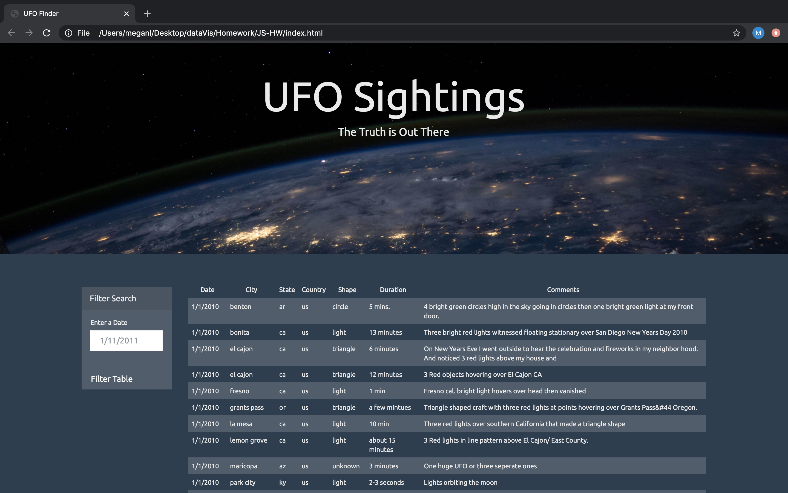

# JavaScript-and-DOM-Manipulation

## Background
Create a web page with JavaScript, HTML, CSS and D3.js to create tables dynamically utilizing Document Object Model (DOM) programming interface based on a given dataset. Users will also need to filter the table data for specific values based on search criteria

## Objectives
- Create a basic HTML web page or use the index.html file provided
- Using the UFO dataset provided in the form of an array of JavaScript objects, write code that appends a table to the web page and then adds new rows of data for each UFO sighting
- Make sure there is a column for `date/time`, `city`, `state`, `country`, `shape`, and `comment` at the very least
- Use a date form in the HTML document and write JavaScript code that will listen for events and search through the date/time column to find rows that match user input  

